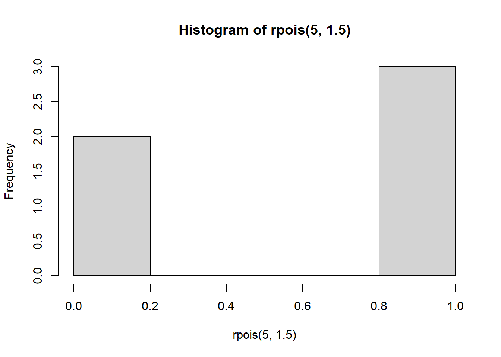

## R code


```r
3 + 6
```

```
[1] 9
```
### R plot


```r
hist(rpois(5, 1.5))
```

<!-- -->
## Python code


```python
print(4 + 3)
```

```
7
```

## $\LaTeX$

$$y = x^2 + 3x - 5$$

## A Table?

|item   | a | b |
|------:|--:|--:|
|tomato | 3 | 5 |
|apple  | 2 | 0 |


### now a table?


```r
knitr::kable(data.frame(x = rnorm(3), y = rnorm(3)))
```

          x           y
-----------  ----------
 -0.0461074   0.5978475
  0.0938664   0.6402793
  0.7244898   0.6087686

...
