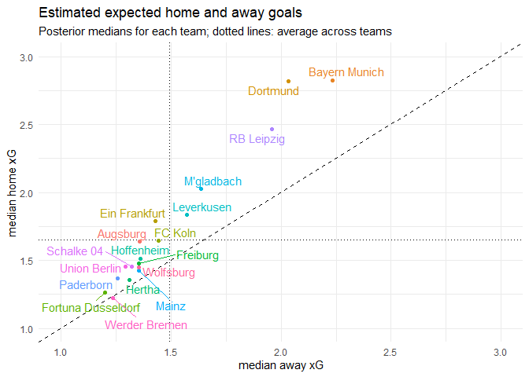
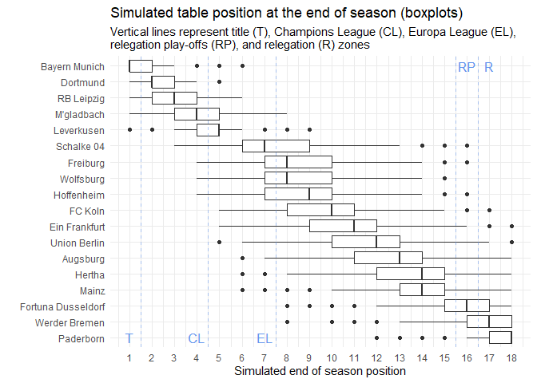
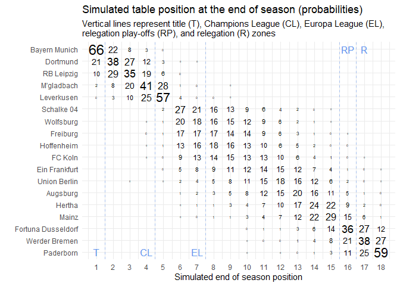

The current Covid-19 crisis brought public life to an abrupt halt. The German Bundesliga paused after its 25th match day. The last match was played on the 11th of March: A so called _Geisterspiel_ between local rivals Gladbach and Köln in an empty Borussia-Park. Without cheering crowds, this derby, which Glabach won 2-1, had a somewhat eerie atmosphere. Amidst all discussion about how and when (or even if) the season should continue, I thought I could just build a simple statistical model and simulate the rest of the season. Admittedly, a simulation is even less exciting than a _Geisterspiel_. It is, however, a good way to show that any Bayesian model is a _generative_ model, i.e. it is like a simulation.

In this post we will load data on goals scored so far in this Bundesliga season and transform it so that we can create tables of standings for all matches that were already played and use our statistical model for all matches that were not played yet. Next, we will specify and fit a Bayesian Poisson Generalized Linear Mixed Model (Poisson GLMM) which we will use to predict the rest of the season. These prediction are like a simulation of potential full Bundesliga season and see briefly investigate how this season could have played out.

## Set-up and data wrangling

First, we will load the packages which we are going to use here. For the data wrangling part we will use the packages in the ``tidyverse``. The modeling will be done using the ``rstanarm`` package. 


```r
library(tidyverse)
library(rstanarm)
```

The data is readily available at [football-data.co.uk](https://www.football-data.co.uk/). They provide a lot of betting odds data and some match statistics. We will ignore most if it, though. For now we will only use data on goals scored by each team. The ``D1-1920.csv`` is read in using the ``read_csv`` function from the ``readr`` package, which is part of the ``tidyverse``. The correct date format is specified here so that it is recognized as a date (and not just some string). Then the relevant columns are selected.


```r
buli1920 <- read_csv(
  "D1-1920.csv",
   col_types = cols(Date = col_date(format = "%d/%m/%Y"))) %>%
  select(Date, HomeTeam:FTR)

buli1920
```

```
# A tibble: 224 x 6
   Date       HomeTeam      AwayTeam            FTHG  FTAG FTR  
   <date>     <chr>         <chr>              <dbl> <dbl> <chr>
 1 2019-08-16 Bayern Munich Hertha                 2     2 D    
 2 2019-08-17 Dortmund      Augsburg               5     1 H    
 3 2019-08-17 Freiburg      Mainz                  3     0 H    
 4 2019-08-17 Leverkusen    Paderborn              3     2 H    
 5 2019-08-17 Werder Bremen Fortuna Dusseldorf     1     3 A    
 6 2019-08-17 Wolfsburg     FC Koln                2     1 H    
 7 2019-08-17 M'gladbach    Schalke 04             0     0 D    
 8 2019-08-18 Ein Frankfurt Hoffenheim             1     0 H    
 9 2019-08-18 Union Berlin  RB Leipzig             0     4 A    
10 2019-08-23 FC Koln       Dortmund               1     3 A    
# ... with 214 more rows
```

The data contains 224 rows -- all the matches that were played in the Bundesliga before Covid-19 brought everything to a halt. The column names for ``Date``, ``HomeTeam``, and ``AwayTeam`` are self-explanatory. The others are:

- ``FTHG`` = Full Time Home Team Goals
- ``FTAG`` = Full Time Away Team Goals
- ``FTR`` = Full Time Result (H = Home Win, D = Draw, A = Away Win).

Normally, a full season with 18 teams has $18 \times 17 = 306$ matches, so we are missing 82. Luckily, we do not have to write down all the matchups we are missing. Using the ``crossing`` function, we create a data set of all combinations of ``HomeTeam`` and ``AwayTeam`` and then remove the cases where home and away teams are the same. (This reminds me of a smuggish remark by some Bayern Munich official who said that the Bayern training matches had more quality than most Bundesliga matches... [but I digress.](https://knowyourmeme.com/memes/congratulations-you-played-yourself))

After creating the table of all possible matchups, we join it with the data that we have. We arrange everything by date and add an arbitrary match identifier, ``match_id``. Note that the missing matches do not have dates, but this is not a problem, since we are ignoring the time dimension for now. Along the way we converted the team columns to factor types with the same levels (that is why we created the sorted ``teams`` vector).


```r
teams <- buli1920$HomeTeam %>% 
  unique() %>%
  sort()

all_matches <- crossing(
    HomeTeam = factor(teams), 
    AwayTeam = factor(teams)
    ) %>% 
  filter(HomeTeam != AwayTeam)

buli1920 <- buli1920 %>% mutate(
    HomeTeam = factor(HomeTeam, levels = teams),
    AwayTeam = factor(AwayTeam, levels = teams)) %>%
  right_join(all_matches, by = c("HomeTeam", "AwayTeam")) %>%
  arrange(Date) %>%
  mutate(match_id = 1:n())

buli1920_obs <- buli1920 %>%
  drop_na()

buli1920_mis <- buli1920 %>%
  filter(is.na(Date))

nrow(buli1920_mis)
```

```
[1] 82
```
As expected, we see that the data frame containing the missing Bundesliga matches has 82 rows. 

Right now the data is in what is called _wide format_. That means we have two columns for teams (home and away) and two columns for goals (again, home and away). All these columns literally make the data frame _wide_. However, for creating a Bundesliga table and for modeling match outcomes it will be useful to have the data in _long_ format, i.e. less columns and more rows. 

A relatively new addition to the ``tidyverse`` are the ``pivot_longer`` and ``pivot_wider`` functions. These help you to get from wide to long data frames and vice versa. Their options are a bit elaborate and I'm still getting used to them. I found the ``_spec`` versions of the functions extremely useful when things become a bit more complicated. With the ``_spec`` approach you first set up a data frame indicating how you want to pivot things. Let's do this for our data set using the ``tribble`` function.


```r
spec <- tribble(
   ~.value, ~.name    , ~side,
   "team" , "HomeTeam", "H"  ,
   "team" , "AwayTeam", "A"  ,
   "G"    , "FTHG"    , "H"  ,
   "G"    , "FTAG"    , "A"  ,
   "GA"   , "FTAG"    , "H"  ,
   "GA"   , "FTHG"    , "A"
  )
```

In the ``.value`` column we put the names of the new columns that we want to create. The ``.name`` column specifies the column names in the old data set which hold the values for the new created values. We then specify another variable (called ``side``) that indicates whether the team (or goal ``G``) is the home (H) or away (A) side. Notice that we create a _goals against_ (GA) column in the process: We take the the away goals in the old data set (``FTAG``) and assign them to ``GA`` in the new data, while ``side == "H"`` indicates that these are the goals against the home side. Similarly for the home goals.

I'm not going to pretend that this is super obvious (at least it was not for me), but I think looking at the results makes everything a bit clearer.


```r
buli1920_long_obs <- buli1920_obs %>%
  pivot_longer_spec(spec)

buli1920_long_obs
```

```
# A tibble: 448 x 7
   Date       FTR   match_id side  team              G    GA
   <date>     <chr>    <int> <chr> <fct>         <dbl> <dbl>
 1 2019-08-16 D            1 H     Bayern Munich     2     2
 2 2019-08-16 D            1 A     Hertha            2     2
 3 2019-08-17 H            2 H     Dortmund          5     1
 4 2019-08-17 H            2 A     Augsburg          1     5
 5 2019-08-17 H            3 H     Freiburg          3     0
 6 2019-08-17 H            3 A     Mainz             0     3
 7 2019-08-17 H            4 H     Leverkusen        3     2
 8 2019-08-17 H            4 A     Paderborn         2     3
 9 2019-08-17 D            5 H     M'gladbach        0     0
10 2019-08-17 D            5 A     Schalke 04        0     0
# ... with 438 more rows
```

Each row now holds the name of a ``team`` and whether it played home or away (``side``), the goals it scored, ``G``, and the goals scored against that team, ``GA``. Now the ``match_id`` comes in handy as it helps us to keep track which rows belong together, i.e. to the same match.

We do the same for the data frame with the missing matches, but that's not really interesting until we predict some new values.


```r
buli1920_long_mis <- buli1920_mis %>%
  pivot_longer_spec(spec)

head(buli1920_long_mis, 4)
```

```
# A tibble: 4 x 7
  Date       FTR   match_id side  team           G    GA
  <date>     <chr>    <int> <chr> <fct>      <dbl> <dbl>
1 NA         <NA>       225 H     Augsburg      NA    NA
2 NA         <NA>       225 A     FC Koln       NA    NA
3 NA         <NA>       226 H     Augsburg      NA    NA
4 NA         <NA>       226 A     Hoffenheim    NA    NA
```

We remove the ``G`` column, which is full of ``NA``s anyway, from the missing matches data frame for now, because this is what we later want to predict. (Otherwise the predict function, that we will use later, will complain that there is already a ``G`` column present.) We can keep ``FTR`` and ``GA`` and fill in the missing values after we predicted the goals column.


```r
buli1920_long_mis <- buli1920_long_mis %>%
  select(-G)
```

But before we do that, let's first re-create the Bundesliga table as it is right now. For that we write a little function, which we can reuse later. The function takes a data frame ``df`` as input and then calculates the points ``pts`` every team got each match and the goal difference ``GD`` for each team in each match. Then, everything is grouped by teams. The number of rows (``n()``) per team is the number of matches played by that team and all other columns are just summed up. We arrange the resulting data frame by points, goal difference and goals, all in descending order and add a positions, ``pos``, column ranging from 1 to 18. 

The function will be usable on the long version of the observed matches data frame.


```r
gen_table <- function(df){
  df %>% 
    mutate(
      pts = case_when(FTR == "D"  ~ 1, 
                      FTR == side ~ 3, 
                      FTR != side ~ 0),
      GD = G - GA
      ) %>%
    group_by(team) %>%
    summarize(
      played = n(), 
      pts = sum(pts), 
      G = sum(G), 
      GA = sum(GA), 
      GD = sum(GD)
      ) %>%
    arrange(
      desc(pts), 
      desc(GD), 
      desc(G)
      ) %>%
    bind_cols("pos" = 1:18, .)
}

pts_table_obs <- buli1920_long_obs %>% 
  gen_table()
```

Let's have a look at it.

<table>
 <thead>
  <tr>
   <th style="text-align:right;">  </th>
   <th style="text-align:left;">  </th>
   <th style="text-align:right;"> Played </th>
   <th style="text-align:right;"> PTS </th>
   <th style="text-align:right;"> G </th>
   <th style="text-align:right;"> GA </th>
   <th style="text-align:right;"> GD </th>
  </tr>
 </thead>
<tbody>
  <tr>
   <td style="text-align:right;width: 3em; "> 1 </td>
   <td style="text-align:left;"> Bayern Munich </td>
   <td style="text-align:right;width: 3em; "> 25 </td>
   <td style="text-align:right;width: 3em; "> 55 </td>
   <td style="text-align:right;width: 3em; "> 73 </td>
   <td style="text-align:right;width: 3em; "> 26 </td>
   <td style="text-align:right;width: 3em; "> 47 </td>
  </tr>
  <tr>
   <td style="text-align:right;width: 3em; "> 2 </td>
   <td style="text-align:left;"> Dortmund </td>
   <td style="text-align:right;width: 3em; "> 25 </td>
   <td style="text-align:right;width: 3em; "> 51 </td>
   <td style="text-align:right;width: 3em; "> 68 </td>
   <td style="text-align:right;width: 3em; "> 33 </td>
   <td style="text-align:right;width: 3em; "> 35 </td>
  </tr>
  <tr>
   <td style="text-align:right;width: 3em; "> 3 </td>
   <td style="text-align:left;"> RB Leipzig </td>
   <td style="text-align:right;width: 3em; "> 25 </td>
   <td style="text-align:right;width: 3em; "> 50 </td>
   <td style="text-align:right;width: 3em; "> 62 </td>
   <td style="text-align:right;width: 3em; "> 26 </td>
   <td style="text-align:right;width: 3em; "> 36 </td>
  </tr>
  <tr>
   <td style="text-align:right;width: 3em; "> 4 </td>
   <td style="text-align:left;"> M'gladbach </td>
   <td style="text-align:right;width: 3em; "> 25 </td>
   <td style="text-align:right;width: 3em; "> 49 </td>
   <td style="text-align:right;width: 3em; "> 49 </td>
   <td style="text-align:right;width: 3em; "> 30 </td>
   <td style="text-align:right;width: 3em; "> 19 </td>
  </tr>
  <tr>
   <td style="text-align:right;width: 3em; "> 5 </td>
   <td style="text-align:left;"> Leverkusen </td>
   <td style="text-align:right;width: 3em; "> 25 </td>
   <td style="text-align:right;width: 3em; "> 47 </td>
   <td style="text-align:right;width: 3em; "> 45 </td>
   <td style="text-align:right;width: 3em; "> 30 </td>
   <td style="text-align:right;width: 3em; "> 15 </td>
  </tr>
  <tr>
   <td style="text-align:right;width: 3em; "> 6 </td>
   <td style="text-align:left;"> Schalke 04 </td>
   <td style="text-align:right;width: 3em; "> 25 </td>
   <td style="text-align:right;width: 3em; "> 37 </td>
   <td style="text-align:right;width: 3em; "> 33 </td>
   <td style="text-align:right;width: 3em; "> 36 </td>
   <td style="text-align:right;width: 3em; "> -3 </td>
  </tr>
  <tr>
   <td style="text-align:right;width: 3em; "> 7 </td>
   <td style="text-align:left;"> Wolfsburg </td>
   <td style="text-align:right;width: 3em; "> 25 </td>
   <td style="text-align:right;width: 3em; "> 36 </td>
   <td style="text-align:right;width: 3em; "> 34 </td>
   <td style="text-align:right;width: 3em; "> 30 </td>
   <td style="text-align:right;width: 3em; "> 4 </td>
  </tr>
  <tr>
   <td style="text-align:right;width: 3em; "> 8 </td>
   <td style="text-align:left;"> Freiburg </td>
   <td style="text-align:right;width: 3em; "> 25 </td>
   <td style="text-align:right;width: 3em; "> 36 </td>
   <td style="text-align:right;width: 3em; "> 34 </td>
   <td style="text-align:right;width: 3em; "> 35 </td>
   <td style="text-align:right;width: 3em; "> -1 </td>
  </tr>
  <tr>
   <td style="text-align:right;width: 3em; "> 9 </td>
   <td style="text-align:left;"> Hoffenheim </td>
   <td style="text-align:right;width: 3em; "> 25 </td>
   <td style="text-align:right;width: 3em; "> 35 </td>
   <td style="text-align:right;width: 3em; "> 35 </td>
   <td style="text-align:right;width: 3em; "> 43 </td>
   <td style="text-align:right;width: 3em; "> -8 </td>
  </tr>
  <tr>
   <td style="text-align:right;width: 3em; "> 10 </td>
   <td style="text-align:left;"> FC Koln </td>
   <td style="text-align:right;width: 3em; "> 25 </td>
   <td style="text-align:right;width: 3em; "> 32 </td>
   <td style="text-align:right;width: 3em; "> 39 </td>
   <td style="text-align:right;width: 3em; "> 45 </td>
   <td style="text-align:right;width: 3em; "> -6 </td>
  </tr>
  <tr>
   <td style="text-align:right;width: 3em; "> 11 </td>
   <td style="text-align:left;"> Union Berlin </td>
   <td style="text-align:right;width: 3em; "> 25 </td>
   <td style="text-align:right;width: 3em; "> 30 </td>
   <td style="text-align:right;width: 3em; "> 32 </td>
   <td style="text-align:right;width: 3em; "> 41 </td>
   <td style="text-align:right;width: 3em; "> -9 </td>
  </tr>
  <tr>
   <td style="text-align:right;width: 3em; "> 12 </td>
   <td style="text-align:left;"> Ein Frankfurt </td>
   <td style="text-align:right;width: 3em; "> 24 </td>
   <td style="text-align:right;width: 3em; "> 28 </td>
   <td style="text-align:right;width: 3em; "> 38 </td>
   <td style="text-align:right;width: 3em; "> 41 </td>
   <td style="text-align:right;width: 3em; "> -3 </td>
  </tr>
  <tr>
   <td style="text-align:right;width: 3em; "> 13 </td>
   <td style="text-align:left;"> Hertha </td>
   <td style="text-align:right;width: 3em; "> 25 </td>
   <td style="text-align:right;width: 3em; "> 28 </td>
   <td style="text-align:right;width: 3em; "> 32 </td>
   <td style="text-align:right;width: 3em; "> 48 </td>
   <td style="text-align:right;width: 3em; "> -16 </td>
  </tr>
  <tr>
   <td style="text-align:right;width: 3em; "> 14 </td>
   <td style="text-align:left;"> Augsburg </td>
   <td style="text-align:right;width: 3em; "> 25 </td>
   <td style="text-align:right;width: 3em; "> 27 </td>
   <td style="text-align:right;width: 3em; "> 36 </td>
   <td style="text-align:right;width: 3em; "> 52 </td>
   <td style="text-align:right;width: 3em; "> -16 </td>
  </tr>
  <tr>
   <td style="text-align:right;width: 3em; "> 15 </td>
   <td style="text-align:left;"> Mainz </td>
   <td style="text-align:right;width: 3em; "> 25 </td>
   <td style="text-align:right;width: 3em; "> 26 </td>
   <td style="text-align:right;width: 3em; "> 34 </td>
   <td style="text-align:right;width: 3em; "> 53 </td>
   <td style="text-align:right;width: 3em; "> -19 </td>
  </tr>
  <tr>
   <td style="text-align:right;width: 3em; "> 16 </td>
   <td style="text-align:left;"> Fortuna Dusseldorf </td>
   <td style="text-align:right;width: 3em; "> 25 </td>
   <td style="text-align:right;width: 3em; "> 22 </td>
   <td style="text-align:right;width: 3em; "> 27 </td>
   <td style="text-align:right;width: 3em; "> 50 </td>
   <td style="text-align:right;width: 3em; "> -23 </td>
  </tr>
  <tr>
   <td style="text-align:right;width: 3em; "> 17 </td>
   <td style="text-align:left;"> Werder Bremen </td>
   <td style="text-align:right;width: 3em; "> 24 </td>
   <td style="text-align:right;width: 3em; "> 18 </td>
   <td style="text-align:right;width: 3em; "> 27 </td>
   <td style="text-align:right;width: 3em; "> 55 </td>
   <td style="text-align:right;width: 3em; "> -28 </td>
  </tr>
  <tr>
   <td style="text-align:right;width: 3em; "> 18 </td>
   <td style="text-align:left;"> Paderborn </td>
   <td style="text-align:right;width: 3em; "> 25 </td>
   <td style="text-align:right;width: 3em; "> 16 </td>
   <td style="text-align:right;width: 3em; "> 30 </td>
   <td style="text-align:right;width: 3em; "> 54 </td>
   <td style="text-align:right;width: 3em; "> -24 </td>
  </tr>
</tbody>
</table>

As a Werder Bremen fan the table is kind of depressing for me, though, so let's quickly move on.

## Modeling match outcomes

Before predicting goal scores and simulating the rest of the season, we have to come up with a model that generates those predictions. In this part of the series I will use a fairly simple model which will only consider team differences in the ability to score goals and the home advantage each team has and ignore, for example defensive capabilities of each team.

In the following section I will briefly go over the mathematical representation of the model. Feel free to skip this part. Then, I will fit the model using ``rstanarm``. I will then summarize the main implications of the models in two plot showing the predicted _expected number of goals_ (or ``xG``) for each team, when they play home and away from home.

### Formulating the model

Working with football data is nice, because the number of goals often match a Poisson distribution pretty closely. I therefore fit a Poisson Generalized Linear Mixed Model (GLMM) with a log-link function, one binary predictor ``home := (side == "H")``, and two grouping variables (``team`` with index $t$ and ``match_id`` with index $m$). The likelihood for our data (scored goals $G$) can be written like this:

$$
\begin{align}
 G\_i        &\sim \text{Poisson}(\mu\_i) \newline
 \log \mu\_i &= \alpha\_{t[i]} + \beta_{t[i]} \text{home}\_i + \delta\_{m[i]}
\end{align}
$$


The coefficient $\alpha$ is the log expected number of goals when $\text{home}=0$, i.e. it measures the expected number of goals when team $t$ plays _not_ at home. When team $t$ _does_ play at home, i.e. $\text{home}=1$, then $\beta$ is the additional effect of playing at home, i.e. the _home advantage_. It is really only an advantage if $\beta>0$, which is a very reasonable assumption -- however, I don't restrict $\beta$ to be positive. 

The $\delta$ is allowed to vary for each match. This will capture unobserved factors which affect _both_ teams (in the same way) in a match. _Unobserved_ here means stuff that is not explicitly in the model, i.e. weather conditions, time of day etc., but I don't expect $\delta$ to be big. Not because the aren't possibly any systematic effects, which are not part of the model, but rather because $\delta$ is an amalgamation of many smaller (and likely counteracting) effects.

Since $\alpha$ and $\beta$ are allowed to vary by team and $\delta$ varies by match, we need to add some structure to the model, otherwise we would be horribly overfitting. Here comes the hierarchical part of the model into play.

$$
\begin{align}
 \delta\_m   &\sim \text{Normal}(0, \sigma\_{M}^2) \newline
 \begin{bmatrix}
    \alpha \newline
    \beta
  \end{bmatrix}\_t &\sim \text{MultiNormal} \left(
    \begin{bmatrix}
      \mu\_\alpha \newline 
      \mu\_\beta
    \end{bmatrix}, \Sigma  \right)
\end{align}
$$

All $\delta\_m$ come from the same distribution with common standard deviation $\sigma\_M$. Here, $\sigma\_M$ is like a hyper-parameter, or tuning parameter which controls the amount of heterogeneity across matches. If $\sigma\_M$ is high, we'd expect a high number of very low scoring games, e.g. 0-0, _and_ a high number of high scoring games, e.g 4-5. When $\sigma\_M$ is low, the match outcomes will follow the estimated expected goals per team more closely.

Expected goals per team are estimated by $\alpha$ and $\beta$ which come from a Multivariate Normal distribution. The mean parameters $\mu\_\alpha$ and $\mu\_\beta$ represent the average of team expected goals away from home ($\mu\_\alpha$) and the average of team home advantages ($\mu\_\beta$). These effects are allowed to be correlated through the covariance matrix $\Sigma$.

Now we have to set priors for these hierarchical parameters.

$$
\begin{align}
 \mu\_\alpha  &\sim \text{Normal}(0.4, 1^2) \newline
 \mu\_\beta   &\sim \text{Normal}(0.3, 0.5^2) \newline
 \sigma\_M    &\sim \text{Exponential}(1) \newline
 \Sigma      &= \begin{bmatrix}
    \sigma\_\alpha & 0 \newline
    0 & \sigma\_\beta
  \end{bmatrix} \Omega \begin{bmatrix}
    \sigma\_\alpha & 0 \newline
    0 & \sigma\_\beta
  \end{bmatrix} \newline
 \sigma\_\alpha, \sigma\_\beta & \sim \text{Exponential}(1) \newline
 \Omega &\sim \text{LKJ}(1)
\end{align}
$$

I chose a prior for $\mu\_\alpha$ which implies that the median of the team expected goals away from home is roughly $\exp(0.4) \approx 1.5$. This means, I expect half of the teams score less than 1.5 goals on average away from home and half of the teams score more than 1.5 goals, when playing away. The prior on $\mu\_\beta$ follows a similar logic. It is set so that $\exp(0.4 + 0.3) \approx 2$ roughly half of the teams playing at home score less than 2 goals on average and the other half scores more than 2 on average when at home.

All other priors are ``rstanarm`` defaults -- I think in reality ``rstanarm`` does something a little more complex, but this should _essentially_ be what's going on: The standard deviations $\sigma\_M, \sigma\_\alpha, \sigma\_\beta$ control the variability of the corresponding hierarchical parameters $\delta, \alpha, \beta$. Their Exponential(1) priors are most likely too wide, but it's better to err on the side of flexibility here.

The correlation matrix $\Omega$ is given a LKJ(1) prior which is uniform in $(-1,1)$. The correlation between $\alpha$ and $\beta$ could be positive, since I'd reckon that good teams (high $\alpha$) play even better at home (high $\beta$). On the other hand, bad teams (low $\alpha$) could follow the strategy to just play good at home (high $\beta$) and don't care so much about winning away matches which would imply a negative correlation. I guess the uniform prior is fine.

### Running the model

We specified a probabilistic model, with a likelihood and priors. In Bayesian statistics we combine the likelihood of the data and our prior beliefs and compute the posterior distribution via Bayes rule. 

$$p(\theta|D) = \frac{p(D|\theta) \times p(\theta)}{p(D)},$$
or 

$$\text{posterior} = \frac{\text{likelihood} \times \text{prior}}{\text{evidence}}$$

The posterior is thus a summary of what we know and belief about the world. If you are not familiar with Bayes theorem, you can check out this awesome video by Grant Sanderson.



Computing the posterior of non-trivial models is often extremely hard, if not impossible. But luckily we can use computers and well crafted programs to help us. 

Now that we have formulated the model, let's fit it.

Bayesian GLMMs can easily be run using the ``rstanarm::stan_glmer()`` function. The ``rstanarm`` package aims at offering Bayesian alternatives to frequently used Frequentist methods -- no pun intended. In this case it mimics the ``glmer`` function from the ``lme4`` package, so we can use the ``lme4`` formula syntax. ``rstanarm`` is build on Stan which is a probabilistic programming language for very efficient Markov Chain Monte Carlo (MCMC) -- a way to produce samples from the posterior distribution of our model. Before we run the model we set the options to tell R that we have multiple cores available for MCMC.


```r
options(mc.cores = parallel::detectCores())

poisson_glmm <- stan_glmer(
  G ~ side + (side|team) + (1|match_id),
  data = buli1920_long_obs, 
  family = poisson(link = "log"),
  prior_intercept = normal(0.4, 1, autoscale = FALSE),
  prior = normal(0.3, 0.5, autoscale = FALSE),
  iter = 2000,
  refresh = 500)
```

The model ran without problems in about 20 seconds on my laptop and produced 4 Markov Chains with 1,000 draws from the posterior each. So for all parameters in our model we have 4,000 plausible values. Let's see the results.

### Results


```r
poisson_glmm
```

```
stan_glmer
 family:       poisson [log]
 formula:      G ~ side + (side | team) + (1 | match_id)
 observations: 448
------
            Median MAD_SD
(Intercept) 0.4    0.1   
sideH       0.1    0.1   

Error terms:
 Groups   Name        Std.Dev. Corr
 match_id (Intercept) 0.076        
 team     (Intercept) 0.251        
          sideH       0.201    0.17
Num. levels: match_id 224, team 18 

------
* For help interpreting the printed output see ?print.stanreg
* For info on the priors used see ?prior_summary.stanreg
```

This summary should be looking familiar to anyone, who used the ``lme4`` package before. It shows summary statistics of the posterior distribution for all parameters.

The posterior median for $\alpha$ is 0.4. That's really close to my prior belief! I'm a bit surprised -- although, I probably shouldn't be, but that's a different and more philosophical debate. The posterior median for $\beta$ is quite a bit lower than my prior belief. $\beta$ is mostly positive though, so there _is_ a measurable home advantage. 

Match heterogeneity denoted by $\delta$ in our model has a very low spread with the posterior median of $\sigma\_M$ being 0.077. Variability across teams in $\sigma\_\alpha$ (median = 0.25) and $\sigma\_\beta$ (median = 0.20) is more prominent. However, I think it's not surprising to find team differences.

Finally, we see that the correlation between scoring goals (away) and home advantage is positive (0.16): Better teams are expected to have an even bigger home advantage. This can also be seen when we plot the median expected goals for home and way matches of each team implied by the model. 



If a team lies on the dashed diagonal line, it's expected goals will be the same in home and away matches. Teams that lie above the dashed line are expected to score more goals at home than away. 

The home advantage is seen for nearly every team (except for Werder Bremen, who really struggled at home this season). We can also see that the cloud of points is tilted slightly above the 45 degree line. This is due to the positive correlation between $\alpha\_t$ and $\beta\_t$ in the model above: Dortmund, Bayern Munich, and RB Leipzig are expected to score more away goals than other teams and even more home goals relative to other teams. Low scoring teams such as Fortuna Düsseldorf, Werder Bremen, and Paderborn on the other hand do not have a strong home advantage -- Werder Bremen even has a slight home _disadvantage_.

Since we estimated a full Bayesian model, we have complete quantification of uncertainty for all the parameters in the model. Instead of looking just at the medians, we can inspect the whole posterior expected goal distribution for each team. 

This second plot draws contour lines for each team separately to avoid cluttering. If you are not familiar with contour lines, think of them as the height indications on a map, where the higher you go, the more probable is the location you are standing in. Location is just a specific combination of expected away goals and expected home goals and the "height" indicates how plausible this location is.


Here we can see differences between teams in a bit more detail. 

For example, Bayern Munich and Borrusia Dortmund both score a lot of goals. Dortmund has the stronger home advantage, while Bayern is better at scoring away from home. 

Comparing Gladbach and Leipzig we see that Leipzig tends to score more goals, but Gladbach has the clearer home advantage and scores a bit more consistently, which you can see in the slightly tighter contour lines. 

Taking a look at the teams at the bottom of the table, Paderborn and Werder Bremen have comparable away goal expectations, while Bremen has a considerably lower range of plausible expected home goals, indicated by the contour lines which fall below the dashed diagonal line.

## Simulating the Bundesliga

Now that we have a model for scoring goals, we can use it to predict outcomes of new matches. So we feed the model and the data for the matches that are still missing in the Bundesliga ``buli1920_long_mis`` into the ``posterior_predict`` function. We will just generate 3 draws from the posterior predictive distribution for the missing data.


```r
n_sims <- 3

pp <- posterior_predict(
  poisson_glmm, 
  newdata = buli1920_long_mis, 
  draws = n_sims
  )

pp
```

```
     1 2 3 4 5 6 7 8 9 10 11 12 13 14 15 16 17 18 19 20 21 22 23 24 25 26 27 28
[1,] 0 3 3 3 3 0 1 4 3  1  5  0  2  1  6  0  2  1  2  2  1  0  6  2  5  1  2  1
[2,] 0 2 2 1 3 1 3 3 1  2  2  0  1  1  6  3  2  4  4  1  2  2  6  2  4  6  2  1
[3,] 0 1 3 1 3 5 1 1 3  6  2  2  0  3  6  1  4  1  2  0  1  2  2  2  4  3  0  4
     29 30 31 32 33 34 35 36 37 38 39 40 41 42 43 44 45 46 47 48 49 50 51 52 53
[1,]  5  0  6  0  2  1  0  1  3  0  3  3  0  1  1  2  1  4  3  0  2  1  1  2  3
[2,]  4  0  2  2  7  1  4  4  0  3  2  1  3  1  1  1  2  2  5  1  1  3  2  4  1
[3,]  2  3  4  4  3  1  1  3  0  0  0  0  1  2  2  2  1  2  1  2  0  0  2  3  0
     54 55 56 57 58 59 60 61 62 63 64 65 66 67 68 69 70 71 72 73 74 75 76 77 78
[1,]  2  2  2  2  2  1  1  2  3  1  2  4  2  1  0  2  1  1  0  3  5  0  4  3  0
[2,]  0  0  1  3  4  4  1  2  2  0  1  1  1  0  1  1  1  1  1  1  2  0  3  0  5
[3,]  1  1  3  3  2  3  2  5  0  0  0  1  2  1  0  1  2  0  1  0  2  0  0  1  1
     79 80 81 82 83 84 85 86 87 88 89 90 91 92 93 94 95 96 97 98 99 100 101 102
[1,]  0  1  0  4  3  2  1  5  1  0  1  2  0  2  2  0  0  0  3  0  2   0   1   1
[2,]  1  0  1  0  4  2  4  4  1  3  3  1  2  3  3  1  2  2  4  1  3   2   3   2
[3,]  2  0  0  1  1  1  1  4  0  4  2  0  0  2  3  1  0  0  1  1  0   1   2   1
     103 104 105 106 107 108 109 110 111 112 113 114 115 116 117 118 119 120
[1,]   5   1   1   3   3   1   2   4   0   2   0   1   1   2   2   1   1   2
[2,]   1   0   2   3   1   2   2   1   3   2   1   1   0   2   6   1   4   2
[3,]   1   1   1   1   0   0   1   2   2   5   1   1   0   2   1   1   1   4
     121 122 123 124 125 126 127 128 129 130 131 132 133 134 135 136 137 138
[1,]   2   1   4   0   4   2   1   0   4   2   1   0   3   2   0   2   0   0
[2,]   4   0   2   1   0   0   0   1   1   1   4   0   2   0   1   2   1   0
[3,]   3   1   4   2   1   0   1   2   3   1   2   2   2   2   1   3   1   2
     139 140 141 142 143 144 145 146 147 148 149 150 151 152 153 154 155 156
[1,]   3   1   0   1   3   2   0   3   2   1   0   3   4   1   0   2   1   1
[2,]   0   2   1   1   0   1   2   4   4   1   3   1   1   2   0   2   2   1
[3,]   0   1   2   0   3   3   1   4   4   2   0   4   0   4   1   0   1   1
     157 158 159 160 161 162 163 164
[1,]   1   3   4   0   1   0   2   3
[2,]   1   2   0   4   3   0   2   0
[3,]   3   1   0   3   0   0   1   0
attr(,"class")
[1] "ppd"    "matrix" "array" 
```

The result is an array of dimension 3 (number of draws) by 164 (number of rows in ``buli1920_long_mis`` -- remember that the data is in long format). 

This is not very handy, so let's write a little helper function. It will take _one_ row from this new array, transform into the long format we used above, add the data for all observed matches and return a big data frame for all matches (observed and simulated) in long format. This function also takes care of the fact that the predicted goals, ``G``, for each team in each match is the predicted goals against, ``GA``, for the other team in that match.


```r
gen_dataset  <- function(i){
  bind_cols(buli1920_long_mis, G = pp[i,]) %>% 
    group_by(match_id) %>% 
    mutate(
      FTR = if_else(diff(G) == 0, "D", side[which.max(G)]),
      GA = sum(G) - G
      ) %>%
    bind_rows(buli1920_long_obs, .) %>%
    mutate(sim = i) %>%
    return()
}
```

We can apply the function to our three posterior predictive draws and generate three whole seasons with observed and simulated data in long format.


```r
map(1:n_sims, gen_dataset)
```

```
[[1]]
# A tibble: 612 x 8
   Date       FTR   match_id side  team              G    GA   sim
   <date>     <chr>    <int> <chr> <fct>         <dbl> <dbl> <int>
 1 2019-08-16 D            1 H     Bayern Munich     2     2     1
 2 2019-08-16 D            1 A     Hertha            2     2     1
 3 2019-08-17 H            2 H     Dortmund          5     1     1
 4 2019-08-17 H            2 A     Augsburg          1     5     1
 5 2019-08-17 H            3 H     Freiburg          3     0     1
 6 2019-08-17 H            3 A     Mainz             0     3     1
 7 2019-08-17 H            4 H     Leverkusen        3     2     1
 8 2019-08-17 H            4 A     Paderborn         2     3     1
 9 2019-08-17 D            5 H     M'gladbach        0     0     1
10 2019-08-17 D            5 A     Schalke 04        0     0     1
# ... with 602 more rows

[[2]]
# A tibble: 612 x 8
   Date       FTR   match_id side  team              G    GA   sim
   <date>     <chr>    <int> <chr> <fct>         <dbl> <dbl> <int>
 1 2019-08-16 D            1 H     Bayern Munich     2     2     2
 2 2019-08-16 D            1 A     Hertha            2     2     2
 3 2019-08-17 H            2 H     Dortmund          5     1     2
 4 2019-08-17 H            2 A     Augsburg          1     5     2
 5 2019-08-17 H            3 H     Freiburg          3     0     2
 6 2019-08-17 H            3 A     Mainz             0     3     2
 7 2019-08-17 H            4 H     Leverkusen        3     2     2
 8 2019-08-17 H            4 A     Paderborn         2     3     2
 9 2019-08-17 D            5 H     M'gladbach        0     0     2
10 2019-08-17 D            5 A     Schalke 04        0     0     2
# ... with 602 more rows

[[3]]
# A tibble: 612 x 8
   Date       FTR   match_id side  team              G    GA   sim
   <date>     <chr>    <int> <chr> <fct>         <dbl> <dbl> <int>
 1 2019-08-16 D            1 H     Bayern Munich     2     2     3
 2 2019-08-16 D            1 A     Hertha            2     2     3
 3 2019-08-17 H            2 H     Dortmund          5     1     3
 4 2019-08-17 H            2 A     Augsburg          1     5     3
 5 2019-08-17 H            3 H     Freiburg          3     0     3
 6 2019-08-17 H            3 A     Mainz             0     3     3
 7 2019-08-17 H            4 H     Leverkusen        3     2     3
 8 2019-08-17 H            4 A     Paderborn         2     3     3
 9 2019-08-17 D            5 H     M'gladbach        0     0     3
10 2019-08-17 D            5 A     Schalke 04        0     0     3
# ... with 602 more rows
```

For the matches that were actually played the data is the same across simulations. It only differs in the simulated matches. One example is the simulated match Wolfsburg - Freiburg with three potential outcomes predicted from our model.


```r
map_df(1:n_sims, ~ gen_dataset(.) %>% tail(2))
```

```
# A tibble: 6 x 8
  Date       FTR   match_id side  team          G    GA   sim
  <date>     <chr>    <int> <chr> <fct>     <dbl> <dbl> <int>
1 NA         A          306 H     Wolfsburg     2     3     1
2 NA         A          306 A     Freiburg      3     2     1
3 NA         H          306 H     Wolfsburg     2     0     2
4 NA         H          306 A     Freiburg      0     2     2
5 NA         H          306 H     Wolfsburg     1     0     3
6 NA         H          306 A     Freiburg      0     1     3
```

We previously created the ``gen_table()`` function which takes in a data frame of match results in long format and returns a table of Bundesliga standings. Using this function on the result of ``gen_dataset()`` will give us an end of season table for the observed matches and one draw of the posterior predictive, i.e. one simulation, for all the missing matches.

When we do this repeatedly, we get many possible outcomes for the rest of this Bundesliga season holding constant all observed matches. Before we do this, let's dial up the number of simulations. The most reasonable number for ``n_sim`` would be to just use all of our posterior draws from the model fit.


```r
n_sims <- poisson_glmm$stanfit@stan_args %>% 
  map(~ pluck(., "iter") - pluck(., "warmup")) %>% 
  unlist() %>% 
  sum()

pp <- posterior_predict(
  poisson_glmm, 
  newdata = buli1920_long_mis, 
  draws = n_sims
  )

sim_tables <- map_df(
  1:n_sims, 
  ~ gen_dataset(.) %>%
    # using the gen_table function created above
    gen_table, 
  .id = "sim")

sim_tables
```

```
# A tibble: 72,000 x 8
   sim     pos team          played   pts     G    GA    GD
   <chr> <int> <fct>          <int> <dbl> <dbl> <dbl> <dbl>
 1 1         1 Dortmund          34    78    95    35    60
 2 1         2 Bayern Munich     34    73   100    44    56
 3 1         3 RB Leipzig        34    72    83    36    47
 4 1         4 M'gladbach        34    64    67    47    20
 5 1         5 Leverkusen        34    62    66    49    17
 6 1         6 Hoffenheim        34    50    48    57    -9
 7 1         7 Freiburg          34    47    46    49    -3
 8 1         8 Wolfsburg         34    46    50    53    -3
 9 1         9 Schalke 04        34    46    42    49    -7
10 1        10 FC Koln           34    44    52    59    -7
# ... with 71,990 more rows
```

This resulted in a data frame with $18 \times 4000 = 72000$ rows, where each simulated end of season table is indexed by ``sim``. We can now plot all resulting ranks for each team.



The boxblots show where most of the simulated ranks fall. The lines is the median posterior rank of each team, the boxes contain 50% of all simulated values. The whiskers span ±1.5 IQR (inter quartile range). Dots represent outliers, or very unlikely results of the simulations.

It looks like there are three groups of teams: The first group are most likely finishing the season in positions 1 to 5 (Bayern Munich to Bayer Leverkusen). Another group are the three teams at the bottom of the table (Düsseldorf, Bremen, Paderborn). All other teams will probably end up in the middle of the table, where some fight for Europa League spots (Schalke, Freiburg, Wolfsburg, and Hoffenheim).

We can also plot the probability for each team to end in a specific spot in the table.



These probabilities are only really high at both ends of the table, since the possible ranks that the teams can reach there are limited -- you can not be better than first place or worse than last, obviously. 

Bayern has a two in three chance of winning the league, while Paderborn has a three in five chance of being directly relegated to the second tier. Interestingly, Düsseldorf has a roughly one in three chance of going into relegation play-offs and Leverkusen has a three in five chance of finishing in the best non-CL spots (5th position).

Since these are valid probabilities, we can add them up for each interesting part of the table (winning the title, CL, EL, relegation play-offs, and immediate relegation).

<table>
 <thead>
  <tr>
   <th style="text-align:right;">  </th>
   <th style="text-align:center;"> Win League </th>
   <th style="text-align:center;"> Champions League </th>
   <th style="text-align:center;"> Europa League </th>
   <th style="text-align:center;"> Mid Table </th>
   <th style="text-align:center;"> Relegation Play-offs </th>
   <th style="text-align:center;"> Relegation </th>
  </tr>
 </thead>
<tbody>
  <tr>
   <td style="text-align:right;"> Bayern Munich </td>
   <td style="text-align:center;width: 5em; "> 67 </td>
   <td style="text-align:center;width: 5em; "> 99 </td>
   <td style="text-align:center;width: 5em; "> 0 </td>
   <td style="text-align:center;width: 5em; ">  </td>
   <td style="text-align:center;width: 5em; ">  </td>
   <td style="text-align:center;width: 5em; ">  </td>
  </tr>
  <tr>
   <td style="text-align:right;"> Dortmund </td>
   <td style="text-align:center;width: 5em; "> 20 </td>
   <td style="text-align:center;width: 5em; "> 96 </td>
   <td style="text-align:center;width: 5em; "> 3 </td>
   <td style="text-align:center;width: 5em; ">  </td>
   <td style="text-align:center;width: 5em; ">  </td>
   <td style="text-align:center;width: 5em; ">  </td>
  </tr>
  <tr>
   <td style="text-align:right;"> RB Leipzig </td>
   <td style="text-align:center;width: 5em; "> 10 </td>
   <td style="text-align:center;width: 5em; "> 94 </td>
   <td style="text-align:center;width: 5em; "> 7 </td>
   <td style="text-align:center;width: 5em; ">  </td>
   <td style="text-align:center;width: 5em; ">  </td>
   <td style="text-align:center;width: 5em; ">  </td>
  </tr>
  <tr>
   <td style="text-align:right;"> M'gladbach </td>
   <td style="text-align:center;width: 5em; "> 2 </td>
   <td style="text-align:center;width: 5em; "> 71 </td>
   <td style="text-align:center;width: 5em; "> 28 </td>
   <td style="text-align:center;width: 5em; "> 0 </td>
   <td style="text-align:center;width: 5em; ">  </td>
   <td style="text-align:center;width: 5em; ">  </td>
  </tr>
  <tr>
   <td style="text-align:right;"> Leverkusen </td>
   <td style="text-align:center;width: 5em; "> 1 </td>
   <td style="text-align:center;width: 5em; "> 39 </td>
   <td style="text-align:center;width: 5em; "> 61 </td>
   <td style="text-align:center;width: 5em; "> 0 </td>
   <td style="text-align:center;width: 5em; ">  </td>
   <td style="text-align:center;width: 5em; ">  </td>
  </tr>
  <tr>
   <td style="text-align:right;"> Schalke 04 </td>
   <td style="text-align:center;width: 5em; ">  </td>
   <td style="text-align:center;width: 5em; ">  </td>
   <td style="text-align:center;width: 5em; "> 50 </td>
   <td style="text-align:center;width: 5em; "> 50 </td>
   <td style="text-align:center;width: 5em; "> 0 </td>
   <td style="text-align:center;width: 5em; ">  </td>
  </tr>
  <tr>
   <td style="text-align:right;"> Wolfsburg </td>
   <td style="text-align:center;width: 5em; ">  </td>
   <td style="text-align:center;width: 5em; ">  </td>
   <td style="text-align:center;width: 5em; "> 37 </td>
   <td style="text-align:center;width: 5em; "> 63 </td>
   <td style="text-align:center;width: 5em; "> 0 </td>
   <td style="text-align:center;width: 5em; ">  </td>
  </tr>
  <tr>
   <td style="text-align:right;"> Freiburg </td>
   <td style="text-align:center;width: 5em; ">  </td>
   <td style="text-align:center;width: 5em; ">  </td>
   <td style="text-align:center;width: 5em; "> 37 </td>
   <td style="text-align:center;width: 5em; "> 63 </td>
   <td style="text-align:center;width: 5em; ">  </td>
   <td style="text-align:center;width: 5em; ">  </td>
  </tr>
  <tr>
   <td style="text-align:right;"> Hoffenheim </td>
   <td style="text-align:center;width: 5em; ">  </td>
   <td style="text-align:center;width: 5em; ">  </td>
   <td style="text-align:center;width: 5em; "> 30 </td>
   <td style="text-align:center;width: 5em; "> 70 </td>
   <td style="text-align:center;width: 5em; "> 0 </td>
   <td style="text-align:center;width: 5em; ">  </td>
  </tr>
  <tr>
   <td style="text-align:right;"> FC Koln </td>
   <td style="text-align:center;width: 5em; ">  </td>
   <td style="text-align:center;width: 5em; ">  </td>
   <td style="text-align:center;width: 5em; "> 23 </td>
   <td style="text-align:center;width: 5em; "> 77 </td>
   <td style="text-align:center;width: 5em; "> 0 </td>
   <td style="text-align:center;width: 5em; ">  </td>
  </tr>
  <tr>
   <td style="text-align:right;"> Ein Frankfurt </td>
   <td style="text-align:center;width: 5em; ">  </td>
   <td style="text-align:center;width: 5em; ">  </td>
   <td style="text-align:center;width: 5em; "> 12 </td>
   <td style="text-align:center;width: 5em; "> 87 </td>
   <td style="text-align:center;width: 5em; "> 1 </td>
   <td style="text-align:center;width: 5em; "> 0 </td>
  </tr>
  <tr>
   <td style="text-align:right;"> Union Berlin </td>
   <td style="text-align:center;width: 5em; ">  </td>
   <td style="text-align:center;width: 5em; ">  </td>
   <td style="text-align:center;width: 5em; "> 6 </td>
   <td style="text-align:center;width: 5em; "> 93 </td>
   <td style="text-align:center;width: 5em; "> 2 </td>
   <td style="text-align:center;width: 5em; "> 0 </td>
  </tr>
  <tr>
   <td style="text-align:right;"> Augsburg </td>
   <td style="text-align:center;width: 5em; ">  </td>
   <td style="text-align:center;width: 5em; ">  </td>
   <td style="text-align:center;width: 5em; "> 3 </td>
   <td style="text-align:center;width: 5em; "> 91 </td>
   <td style="text-align:center;width: 5em; "> 5 </td>
   <td style="text-align:center;width: 5em; "> 1 </td>
  </tr>
  <tr>
   <td style="text-align:right;"> Hertha </td>
   <td style="text-align:center;width: 5em; ">  </td>
   <td style="text-align:center;width: 5em; ">  </td>
   <td style="text-align:center;width: 5em; "> 1 </td>
   <td style="text-align:center;width: 5em; "> 88 </td>
   <td style="text-align:center;width: 5em; "> 9 </td>
   <td style="text-align:center;width: 5em; "> 2 </td>
  </tr>
  <tr>
   <td style="text-align:right;"> Mainz </td>
   <td style="text-align:center;width: 5em; ">  </td>
   <td style="text-align:center;width: 5em; ">  </td>
   <td style="text-align:center;width: 5em; "> 0 </td>
   <td style="text-align:center;width: 5em; "> 79 </td>
   <td style="text-align:center;width: 5em; "> 14 </td>
   <td style="text-align:center;width: 5em; "> 6 </td>
  </tr>
  <tr>
   <td style="text-align:right;"> Fortuna Dusseldorf </td>
   <td style="text-align:center;width: 5em; ">  </td>
   <td style="text-align:center;width: 5em; ">  </td>
   <td style="text-align:center;width: 5em; ">  </td>
   <td style="text-align:center;width: 5em; "> 24 </td>
   <td style="text-align:center;width: 5em; "> 35 </td>
   <td style="text-align:center;width: 5em; "> 40 </td>
  </tr>
  <tr>
   <td style="text-align:right;"> Werder Bremen </td>
   <td style="text-align:center;width: 5em; ">  </td>
   <td style="text-align:center;width: 5em; ">  </td>
   <td style="text-align:center;width: 5em; ">  </td>
   <td style="text-align:center;width: 5em; "> 14 </td>
   <td style="text-align:center;width: 5em; "> 22 </td>
   <td style="text-align:center;width: 5em; "> 65 </td>
  </tr>
  <tr>
   <td style="text-align:right;"> Paderborn </td>
   <td style="text-align:center;width: 5em; ">  </td>
   <td style="text-align:center;width: 5em; ">  </td>
   <td style="text-align:center;width: 5em; ">  </td>
   <td style="text-align:center;width: 5em; "> 4 </td>
   <td style="text-align:center;width: 5em; "> 12 </td>
   <td style="text-align:center;width: 5em; "> 84 </td>
  </tr>
</tbody>
</table>

We now see that Paderborns risk of immediate relegation is quite high. Also Werder Bremen has a roughly two in three chance of being relegated to second division directly. 

Collapsing the table also shows that many teams will finish in the middle of the table with very high probability. Union Berlin for example has a more than 9 out of 10 chance to end up mid table, which can be considered a big success for them. 

The CL spots are very likely going to the top four teams. Only Bayer Leverkusen might have a chance to snack a spot and send Gladbach into EL. 

The Europa League will be the most contested place in the table. More than a handful of teams have a realistic chance to grab one of these spots, but they will most likely go to Leverkusen, Schalke, and Wolfsburg, leaving Freiburg and Hoffenheim close behind.

When the Bundesliga shut down due to the Covid-19 crisis, it was not really clear if the 2019//2020 season would be finished at all. I was asking myself, who would be in favor of stopping the season and who would be in favor of playing on? (Setting aside all valid health concerns, the monetary incentive to play a match, and any special rules like no-relegation in case of stopping the season, of course.) The question mainly boils down to: _If the season were to continue, would my team be expected to finish higher up the table, or lower?_

<table>
 <thead>
  <tr>
   <th style="text-align:right;">   </th>
   <th style="text-align:left;"> Team </th>
   <th style="text-align:right;"> same </th>
   <th style="text-align:right;"> lower </th>
   <th style="text-align:right;"> higher </th>
  </tr>
 </thead>
<tbody>
  <tr>
   <td style="text-align:right;"> 1 </td>
   <td style="text-align:left;"> Bayern Munich </td>
   <td style="text-align:right;width: 4em; "> 67.1 </td>
   <td style="text-align:right;width: 4em; "> 32.9 </td>
   <td style="text-align:right;width: 4em; "> 0.0 </td>
  </tr>
  <tr>
   <td style="text-align:right;"> 2 </td>
   <td style="text-align:left;"> Dortmund </td>
   <td style="text-align:right;width: 4em; "> 37.9 </td>
   <td style="text-align:right;width: 4em; "> 41.6 </td>
   <td style="text-align:right;width: 4em; "> 20.5 </td>
  </tr>
  <tr>
   <td style="text-align:right;"> 3 </td>
   <td style="text-align:left;"> RB Leipzig </td>
   <td style="text-align:right;width: 4em; "> 34.1 </td>
   <td style="text-align:right;width: 4em; "> 25.5 </td>
   <td style="text-align:right;width: 4em; "> 40.4 </td>
  </tr>
  <tr>
   <td style="text-align:right;"> 4 </td>
   <td style="text-align:left;"> M'gladbach </td>
   <td style="text-align:right;width: 4em; "> 40.9 </td>
   <td style="text-align:right;width: 4em; "> 28.2 </td>
   <td style="text-align:right;width: 4em; "> 30.9 </td>
  </tr>
  <tr>
   <td style="text-align:right;"> 5 </td>
   <td style="text-align:left;"> Leverkusen </td>
   <td style="text-align:right;width: 4em; "> 57.3 </td>
   <td style="text-align:right;width: 4em; "> 4.3 </td>
   <td style="text-align:right;width: 4em; "> 38.4 </td>
  </tr>
  <tr>
   <td style="text-align:right;"> 6 </td>
   <td style="text-align:left;"> Schalke 04 </td>
   <td style="text-align:right;width: 4em; "> 27.4 </td>
   <td style="text-align:right;width: 4em; "> 70.8 </td>
   <td style="text-align:right;width: 4em; "> 1.8 </td>
  </tr>
  <tr>
   <td style="text-align:right;"> 7 </td>
   <td style="text-align:left;"> Wolfsburg </td>
   <td style="text-align:right;width: 4em; "> 17.5 </td>
   <td style="text-align:right;width: 4em; "> 62.6 </td>
   <td style="text-align:right;width: 4em; "> 19.8 </td>
  </tr>
  <tr>
   <td style="text-align:right;"> 8 </td>
   <td style="text-align:left;"> Freiburg </td>
   <td style="text-align:right;width: 4em; "> 16.6 </td>
   <td style="text-align:right;width: 4em; "> 46.1 </td>
   <td style="text-align:right;width: 4em; "> 37.3 </td>
  </tr>
  <tr>
   <td style="text-align:right;"> 9 </td>
   <td style="text-align:left;"> Hoffenheim </td>
   <td style="text-align:right;width: 4em; "> 15.3 </td>
   <td style="text-align:right;width: 4em; "> 37.6 </td>
   <td style="text-align:right;width: 4em; "> 47.1 </td>
  </tr>
  <tr>
   <td style="text-align:right;"> 10 </td>
   <td style="text-align:left;"> FC Koln </td>
   <td style="text-align:right;width: 4em; "> 14.2 </td>
   <td style="text-align:right;width: 4em; "> 35.9 </td>
   <td style="text-align:right;width: 4em; "> 49.9 </td>
  </tr>
  <tr>
   <td style="text-align:right;"> 11 </td>
   <td style="text-align:left;"> Union Berlin </td>
   <td style="text-align:right;width: 4em; "> 15.3 </td>
   <td style="text-align:right;width: 4em; "> 54.5 </td>
   <td style="text-align:right;width: 4em; "> 30.2 </td>
  </tr>
  <tr>
   <td style="text-align:right;"> 12 </td>
   <td style="text-align:left;"> Ein Frankfurt </td>
   <td style="text-align:right;width: 4em; "> 12.9 </td>
   <td style="text-align:right;width: 4em; "> 26.0 </td>
   <td style="text-align:right;width: 4em; "> 61.1 </td>
  </tr>
  <tr>
   <td style="text-align:right;"> 13 </td>
   <td style="text-align:left;"> Hertha </td>
   <td style="text-align:right;width: 4em; "> 15.4 </td>
   <td style="text-align:right;width: 4em; "> 58.8 </td>
   <td style="text-align:right;width: 4em; "> 25.8 </td>
  </tr>
  <tr>
   <td style="text-align:right;"> 14 </td>
   <td style="text-align:left;"> Augsburg </td>
   <td style="text-align:right;width: 4em; "> 16.3 </td>
   <td style="text-align:right;width: 4em; "> 17.6 </td>
   <td style="text-align:right;width: 4em; "> 66.0 </td>
  </tr>
  <tr>
   <td style="text-align:right;"> 15 </td>
   <td style="text-align:left;"> Mainz </td>
   <td style="text-align:right;width: 4em; "> 27.6 </td>
   <td style="text-align:right;width: 4em; "> 20.9 </td>
   <td style="text-align:right;width: 4em; "> 51.6 </td>
  </tr>
  <tr>
   <td style="text-align:right;"> 16 </td>
   <td style="text-align:left;"> Fortuna Dusseldorf </td>
   <td style="text-align:right;width: 4em; "> 35.3 </td>
   <td style="text-align:right;width: 4em; "> 40.4 </td>
   <td style="text-align:right;width: 4em; "> 24.3 </td>
  </tr>
  <tr>
   <td style="text-align:right;"> 17 </td>
   <td style="text-align:left;"> Werder Bremen </td>
   <td style="text-align:right;width: 4em; "> 36.4 </td>
   <td style="text-align:right;width: 4em; "> 28.3 </td>
   <td style="text-align:right;width: 4em; "> 35.2 </td>
  </tr>
  <tr>
   <td style="text-align:right;"> 18 </td>
   <td style="text-align:left;"> Paderborn </td>
   <td style="text-align:right;width: 4em; "> 58.4 </td>
   <td style="text-align:right;width: 4em; "> 0.0 </td>
   <td style="text-align:right;width: 4em; "> 41.6 </td>
  </tr>
</tbody>
</table>

The ordering in this table is the same as above for the observed matches, the _same_ column states the model based probability of finishing the season in the same spot as when it was paused. If the probability of finishing _higher_ is greater than the probability of finishing _lower_, you should prefer playing the season until the end. If it's the other way around, you should prefer stopping the season right now. 

There are some obvious choices here, for example Bayern Munich would be fine to end the season and win the title, while Paderborn has nothing to lose playing through the season and maybe preventing relegation. It might be not so obvious for Gladbach: Of course the probability is higher to finish in a better position, but there is a non-negligible risk of dropping to the fifth place and play EL instead of playing CL next season.

## Wrapping up

In this post, we created a table of Bundesliga standings for all matches that have been played in this season so far. We transformed the data to be in long format to use it modeling the expected number of goals per team. We formulated and fitted a hierarchical Bayesian model for goal scoring. However, we did not consider defensive strengths of teams or any other additional information apart from home advantage. Finally, we used the models predictions to simulate how the Bundesliga could have played out and summarized the results in various ways.

In the next part of this series, I will make the model a bit more interesting and incorporate defensive capabilities of teams. For this, we will write our very own Stan model code. So stay tuned! :wink:


